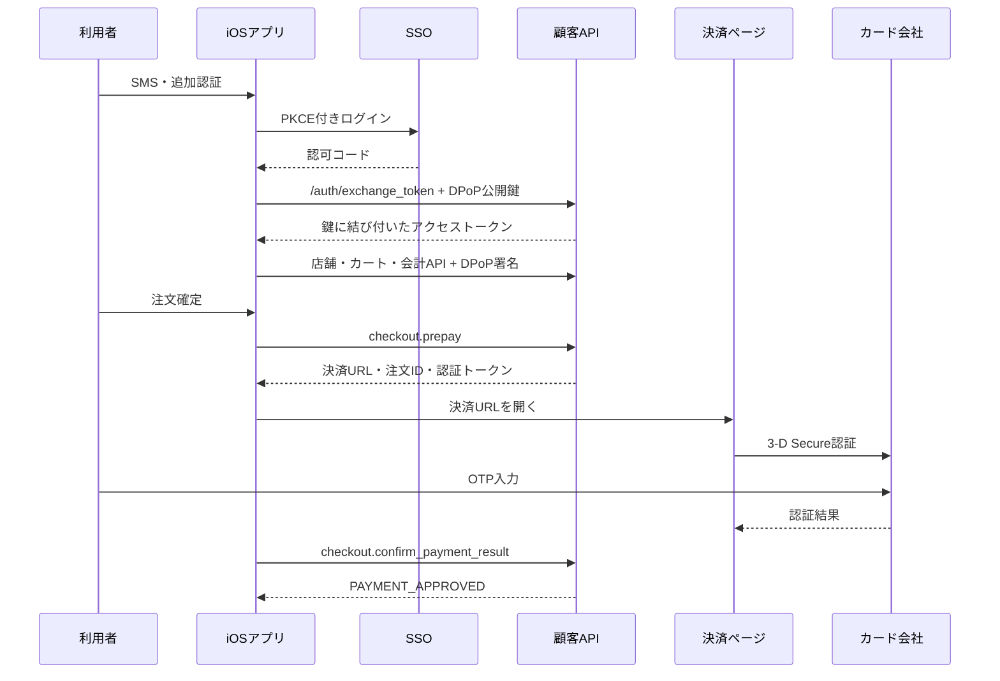

# ロケットナウ通信調査メモ

## 対象と方法

本人所有のiOS端末に設定したローカルmitmproxyの記録を読み取り、HTTPメソッド・パス・リクエスト項目・レスポンス構造を調べた。個人情報、認証トークン、Cookie、住所、注文内容の実値はこの文書に記録しない。

## Evidence → Finding → Path

| Evidence | Finding | Path |
|---|---|---|
| 2026-09-25の `csg.rocketnow.co.jp` 通信で `store.get_search`、`store.get_store_with_menu`、`store.get_dish_v2` を確認 | 検索・店舗・商品詳細は個別の読み取りAPI | `src/rocketnow_cli/api.py` の検索・詳細メソッド |
| `account.search_orders`、`account.get_default_address`、`checkout.get_payment_methods` を確認 | 注文履歴・保存済み配送先・決済方法を取得できる | CLIの `orders`、`address`、`payment-methods` |
| `checkout.calculate_cart_price` と `checkout.display_v4` のPOST、および請求額・手数料を含むレスポンスを確認 | 会計プレビューまでは注文確定なしで可能 | CLIの `cart-quote`、`checkout-preview` |
| APIリクエストの `Authorization: DPoP`、ES256 proof、トークンの `cnf.jkt` を照合 | トークンはP-256公開鍵に結び付く | `src/rocketnow_cli/dpop.py` |
| 再ログイン時のPKCE付きSSOと `/auth/exchange_token` を確認し、8082番の専用プロキシでCLI用トークンを取得 | CLI自身の鍵でトークン交換できる | `src/rocketnow_cli/auth.py` と専用プロキシによるペアリング |
| CLI生成の端末ID・PCIDで検索、店舗、商品、カート計算、会計プレビューがJSON応答 | アプリの個別識別子をコピーせず主要フローを実行できる | `src/rocketnow_cli/transport.py`、`cart.py` |
| カード注文の通信例で `checkout.prepay` → 決済ページ → 3-D Secure 2.2のOTP → `checkout.confirm_payment_result` を確認 | カード注文には本人の決済認証が必要。`prepay` を購入開始として扱う | `src/rocketnow_cli/order.py`、`cli.py` |
| 捕捉した `prepay` リクエストとCLIのオフライン組み立て結果を比較し、端末UUIDとIP以外の項目が一致 | 購入リクエストの構造は再現できた | `order check` と単体テスト |
| 応答例では `cancel_order` がHTTP 200でも `data=null` と `error` を返した | HTTP成功だけでは操作の成立を意味しない | 注文状態はAPIの `data` / `error` を確認する |

## 確認済みの流れ

## 未確認事項

- CLIからの実購入は未検証。`order check` は実APIで動作し、承認不一致なら `prepay` 前に停止することを確認した。注文送信、Macブラウザでの決済URL表示、決済結果確認は次の承認済み実注文で検証する。
- 決済URLの最初の取得にはアプリのCookie・認証ヘッダーが付いていた。URLだけでMacブラウザから表示できるかは未確認。
- Macの直接SSOアクセスはAkamaiから403になった。ブラウザでの単独ログインは未実現。専用プロキシでのペアリングは動作確認済み。
- 注文履歴APIでは空の `nextToken` も必須。これを送るとCLIからJSON応答を得られる。

## 購入ゲート

`order check` は商品・配送指示・配送種別・請求額・保存済みカードIDとマスク番号を含む最終 `prepay` リクエストを組み立て、10分有効の一度限りの承認ハッシュを発行する。`order submit` は購入直前に会計を再計算し、ハッシュと金額が一致する場合だけ `prepay` を送る。応答の請求額が承認額から変わった場合は決済URLを開かず要確認状態にする。通信が切れた場合も自動再送しない。これらの制御はオフラインテストと購入前の実APIで検証済みで、実購入の送信は未検証。
